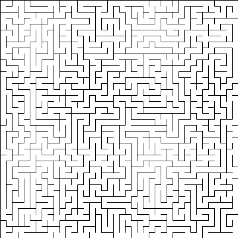
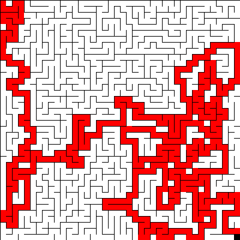

# Maze generation and solving

## What i have learned
- Using a depth-first search algorithm to generate a maze
- Using backtracking and "always going towards target" to get through the generated maze

